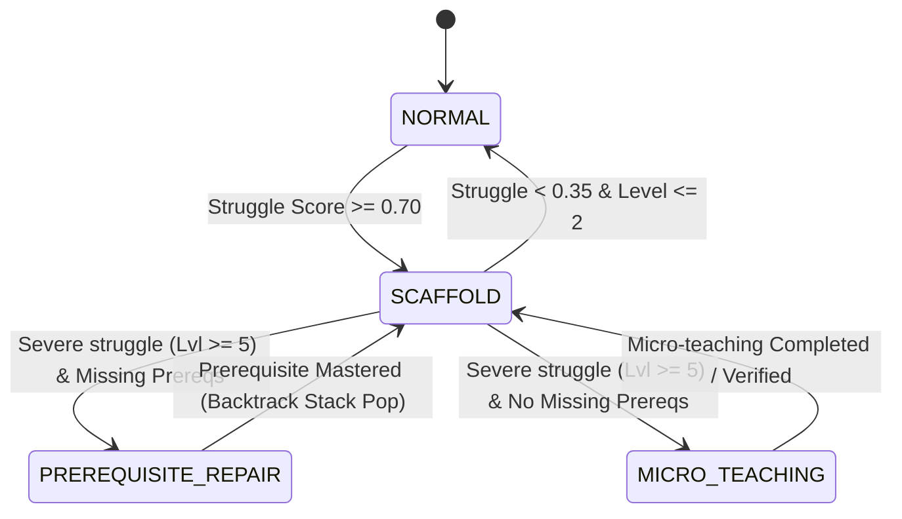

# Feature Specification: Mastery DAG, Struggle Detection & Recovery FSM (`feature/mastery-struggle-detection`)

> **Branch:** `feature/mastery-struggle-detection`  
> **Author / Lead:** `usm` (Agent Intelligence & Adaptive Engine Lead)  
> **Parent Branch:** `feature/assistance-hint-ladder`  
> **Status:** Implemented & Verified  

---

## 1. Overview & Architecture

The **Mastery DAG, Struggle Detection & Recovery FSM** engine forms the cognitive tracking and pedagogical remediation foundation of PeerRing. It continuously observes student attempts, maintains a directed acyclic graph (DAG) of curriculum concepts with exponentially weighted mastery updates, computes multi-factor struggle metrics, and orchestrates remediation transitions across four distinct recovery states.

```
       ┌────────────────────────────────────────────────────────┐
       │             Student Turn / Response Event              │
       └──────────────────────────┬─────────────────────────────┘
                                  │
           ┌──────────────────────┴──────────────────────┐
           ▼                                             ▼
┌──────────────────────────────┐              ┌──────────────────────────────┐
│    CurriculumDAGManager      │              │       StruggleDetector       │
│  - Exponential Moving Avg    │              │  - Error streak (w=0.35)     │
│  - Concept unlock logic      │              │  - Ladder level (w=0.30)     │
│  - Missing prereqs traversal │              │  - Hesitation latency (0.15) │
│  - Cycle detection           │              │  - Explicit help (w=0.20)    │
└──────────┬───────────────────┘              └──────────────┬───────────────┘
           │                                                 │
           └──────────────────────┬──────────────────────────┘
                                  ▼
                   ┌──────────────────────────────┐
                   │    RecoveryStateMachine      │
                   │  - NORMAL                    │
                   │  - SCAFFOLD                  │
                   │  - PREREQUISITE_REPAIR       │
                   │  - MICRO_TEACHING            │
                   └──────────────┬───────────────┘
                                  │ Severe Prerequisite Deficit
                                  ▼
                   ┌──────────────────────────────┐
                   │   PrerequisiteBacktracker    │
                   │  - Backtrack Stack Push/Pop  │
                   │  - Foundational Concept Path │
                   │  - Remediation Resolution    │
                   └──────────────────────────────┘
```

---

## 2. Mathematical Formulations

### A. Exponential Moving Average (EMA) Mastery Tracking
Mastery score $M_t$ is updated continuously after each student attempt:

$$M_t = \begin{cases} T_t, & \text{if } t = 1 \\ (1 - \alpha) M_{t-1} + \alpha T_t, & \text{if } t > 1 \end{cases}$$

Where:
- $\alpha = 0.35$ (learning rate sensitivity factor)
- $T_t \in \{0.0, 1.0\}$ (outcome target: $1.0$ for success, $0.0$ for error)
- Mastery threshold: $M_t \ge 0.70$ unlocks dependent concepts.

### B. Composite Struggle Detection Equation
Real-time struggle score $S \in [0.0, 1.0]$ combines four independent behavioral signals:

$$S = w_{\text{error}} F_{\text{error}} + w_{\text{ladder}} F_{\text{ladder}} + w_{\text{latency}} F_{\text{latency}} + w_{\text{help}} F_{\text{help}}$$

Default weights:
- $w_{\text{error}} = 0.35$
- $w_{\text{ladder}} = 0.30$
- $w_{\text{latency}} = 0.15$
- $w_{\text{help}} = 0.20$

Where:
- $F_{\text{error}} = 0.6 \cdot \min\left(\frac{\text{consecutive\_errors}}{3}, 1\right) + 0.4 \cdot (1 - \text{accuracy}_{\text{concept}})$
- $F_{\text{ladder}} = \frac{\text{current\_level} - 1}{5}$
- $F_{\text{latency}} = \min\left(\frac{\text{latency\_sec}}{60.0}, 1.0\right)$
- $F_{\text{help}} = 1.0 \text{ if explicit help requested else } 0.0$

Breaching $S \ge 0.70$ triggers a `STRUGGLE_THRESHOLD_BREACHED` PRISM event and alerts the Recovery State Machine.

---

## 3. Recovery State Machine Transitions



1. **`NORMAL`**: Standard collaborative peer-ring dynamic auction.
2. **`SCAFFOLD`**: Hint Ladder escalation, Bob increases socratic scaffolding, peers guide without answers.
3. **`PREREQUISITE_REPAIR`**: Target concept suspended; session moves down the curriculum DAG to repair root unmastered prerequisites.
4. **`MICRO_TEACHING`**: Isolated concept confusion with satisfied prerequisites; tutor pauses open dialogue for structured 1-on-1 walkthrough.

---

## 4. Prerequisite Backtracking Algorithm

1. When `PREREQUISITE_REPAIR` is triggered, `PrerequisiteBacktracker.find_repair_target()` performs a topological search to discover the deepest root unmastered concept.
2. `execute_backtrack()` pushes the suspended target concept onto `state.prism_trace_metadata["recovery_stack"]`, switches `state.current_concept` to the repair target, resets the hint ladder, and emits `PREREQUISITE_BACKTRACK_INITIATED`.
3. Once the student demonstrates mastery on the foundational concept ($M_t \ge 0.70$), `resolve_repair()` pops the suspended concept from the stack, restores it as `state.current_concept`, sets recovery state back to `SCAFFOLD`, and emits `PREREQUISITE_REPAIR_COMPLETED`.

---

## 5. Telemetry & PRISM Events

| Event Name | Trigger Condition | Key Metadata Payload |
|---|---|---|
| `CURRICULUM_MASTERY_UPDATED` | Concept practice attempt | `concept_id`, `previous_score`, `new_score`, `delta`, `attempts`, `is_mastered`, `unlocked_next` |
| `STRUGGLE_SCORE_EVALUATED` | Periodic/turn struggle check | `struggle_score`, `stuck_threshold`, `components` (error, ladder, latency, help) |
| `STRUGGLE_THRESHOLD_BREACHED` | Score crosses stuck threshold | `struggle_score`, `stuck_threshold`, `newly_breached=True` |
| `RECOVERY_STATE_TRANSITION` | FSM state change | `initial_state`, `final_state`, `reason`, `struggle_score`, `ladder_level`, `missing_prerequisites` |
| `PREREQUISITE_BACKTRACK_INITIATED` | Backtrack started | `original_concept`, `target_concept`, `stack_depth` |
| `PREREQUISITE_REPAIR_COMPLETED` | Prerequisite mastered | `completed_repair_concept`, `restored_concept`, `remaining_stack_depth` |

---

## 6. Verification & Test Coverage

All 13 unit and integration tests pass in `backend/tests/adaptive/test_mastery_recovery.py`:
- `TestCurriculumDAGManager`: Node registration, symmetric unlock graph, cycle detection, topological dependency chains, EMA updates.
- `TestStruggleDetector`: Signal sensitivity, low struggle on success, threshold breach on errors, latency, and help.
- `TestRecoveryStateMachine`: `NORMAL` $\to$ `SCAFFOLD` $\to$ `PREREQUISITE_REPAIR` / `MICRO_TEACHING` $\to$ `NORMAL` cycle.
- `TestPrerequisiteBacktrackIntegration`: Full stack push, unmastered prevention, repair mastery demonstration, stack pop restoration.
